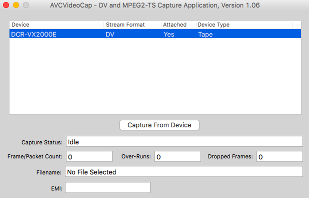
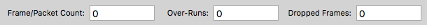

# Digital Capture of DV Tapes

While DV is contained on tapes in the same manner as analog media, since DV is a digital recording format it makes sense to treat DV tapes as born-digital content and archive them accordingly. Provided the correct adapters are available, DV content is able to be captured natively using the FireWire out that exists on DV playback machines.

This method has several advantages over capturing DV as analog video using a standard A/D converter. Not only will the captured DV stream conform to the data that was stored on the tape, which bolsters archival provenance, the amount of metadata contained within this stream can aid both quality control and cataloging. Using tools such as [MediaInfo](https://mediaarea.net/en/MediaInfo), [MediaInfo Online](https://mediaarea.net/MediaInfoOnline) and [DV Analyzer](https://mediaarea.net/DVAnalyzer) allows analysis of information such as recording time stamps, embedded timecode and playback error concealment. A sample DV Analyzer output is included below:

__NOTE__ DV files can be pretty big (around 10GB per hour). If you are planning on moving the files between the Mac stations and a Windows computer via an external drive, you must make sure that it is formatted correctly! Some disk formats limit maximum file sizes, which can get you into trouble with DV. It is recommended that any external drives used in this project be formatted in the [ExFAT](https://en.wikipedia.org/wiki/ExFAT) format.

# Pre-transfer Inspection
* Before inserting the tape into the player, do a visual inspection. Is the lock tab (pictured below) set to the `SAVE` position? If not, then move it to `SAVE`. Check to see if the tape pack looks normal.

# Camera/Player Setup

To connect the player/camera to the computer you will use the 'DV Out' port (example picture below) on the camera and connect it via the FireWire to Thunderbolt adapter. This enables the computer to control the player and capture the contents of the tape as data rather than as analog video. If using the CDSC DV camera (manual available [here](https://www.sony.co.uk/electronics/support/res/manuals/3061/30615081M.pdf))as your playback device, set the power switch to 'VCR' mode.

Once you have inserted the tape into the player, fast-forward it to the end and then rewind it once to make sure that the tape tension is ready for correct playback. Tapes that have not been played for a long time are subject to certain amounts of temperature induced expansion and contraction which can create loose tape winds that are problematic on playback.

# Transferring with AVCVideoCap (Suggested method)

AVCVideoCap can be downloaded through the [Apple Developer Tools](https://developer.apple.com/develop/) (an account must be registered first). It is a part of the FireWire SDK and can be downloaded by searching for `Firewire` and then installing the package. To be safe, you should change the computer sleep settings in `System Preferences` so that it will not go to sleep during the capture process.

Upon opening AVCVideoCap you will see a screen like this - if the computer is registering the playback device correctly it should appear in the 'Device' list. If the playback machine doesn't appear, check your connections and make sure the player is set to the right mode and/or powered on. Once you are ready to start your transfer, press `Capture From Device`.

When prompted, enter the name of the file for the DV transfer. Next you will be prompted to choose a recording mode. Select `Tape Control`. When `Continue` is pressed, the capture will begin and the computer will control the player automatically.

As the capture progresses, the number in the `Frame/Packet Count` box will increase - this represents the data that you are capturing. You do not want the numbers in `Over-Runs` or `Dropped-Frames` to increase as this means that some of the data has been lost during the capture process. 

# Transferring with Premiere (Non-preferred Method)

Premier is capable of capturing data from DV tapes, but is not the preferred method due to its tendency to drop frames when it encounters a problem segment. If there are no problem segments, and Premier is able to capture a tape as a single file then that file may be considered preservation quality. It is, however, available within the Libraries using existing infrastructure so instructions for its use are being included.

First create a new project within Premier. Make sure that the `Capture Settings` are set to DV.

The `Capture Window` can be opened via the File menu.

Once in the Capture Window, the camera can be controlled from within Premier. Once ready to capture, press the `Tape`button. This will create MOV wrapped files of the DV stream into the project directory. Once you are done capturing, close the transfer window and right click on one of the clips in the project window. Choose 'Reveal in Finder.' This will show you where your files have actually been saved.

# Post Transfer Processing
* [DV Analyzer](https://mediaarea.net/DVAnalyzer):
Files should be inspected using the `DV Analyzer` tool. This tool allows the embedded timecode metadata as well as error correction information to be inspected. Since DV is a tape based format, it is normal to have a certain amount of errors, but checking the file information with DV Analyzer will allow you to identify if there were any particularly problematic segments.

* Re-wrap to raw DV if desired: Since Premier captures DV files in a MOV wrapper, it may be preferable to re-wrap them to a raw DV stream. This is slightly smaller, and a more true representation of the data contained on the tape. To do this, use the progam [FFmpeg](https://www.ffmpeg.org/) and the following command: `ffmpeg -i INPUT.mov - f rawvideo -c:v copy OUTPUT.dv`

## Make Derivatives
The following FFmpeg commands will create a high quality `mp4` file that has been deinterlaced for optimum viewing quality on modern screens.
* Command for derivative: `ffmpeg -i INPUT.dv -c:v libx264 -pix_fmt yuv420p -movflags +faststart -preset slow -crf 18 -c:a aac -ar 48k -b:a 128k -vf yadif=deint=1 OUTPUT.mp4`

Alternately, if the original transfer was broken up into segments and it is desirable to combine them into a single access file, the concat function of FFmpeg [explanation here](https://amiaopensource.github.io/ffmprovisr/#join_files) can be used:
`ffmpeg -f concat -safe 0 -i ListOfDVs.txt -c:v libx264 -pix_fmt yuv420p -movflags +faststart -preset slow -crf 18 -c:a aac -ar 48k -b:a 128k -vf yadif=deint=1 OUTPUT.mp4`

# Resources
* [Information](https://www.adamwilt.com/DV-tech.html) about DV specifications and various formats
* [DV Analyzer](https://mediaarea.net/DVAnalyzer/what-does-it-analyze) list of information about the metadata that DV Analyzer reads.
* [ffmprovisr](https://amiaopensource.github.io/ffmprovisr/) resource with annotated example FFmpeg commands.
